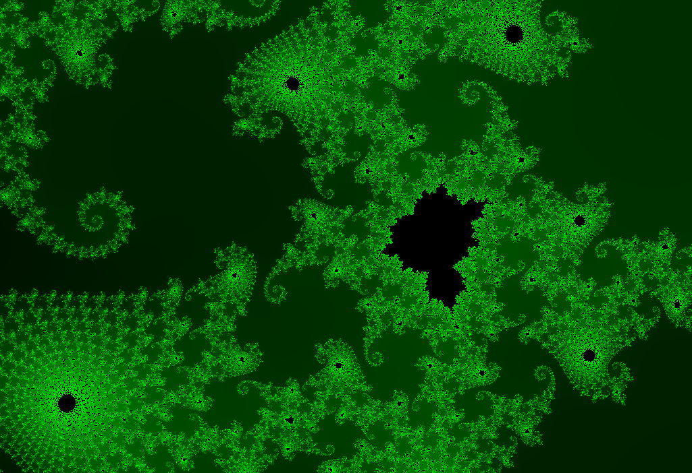

# webgpu-mandelbrot

rendering the mandelbrot set in webgpu

### live demo

https://webgpu-mandelbrot.netlify.app

### limitations

as of writing only Chrome supports WebGPU, so that's the only browser where this'll work

interestingly, even after updating to use emulated f64, pixelation still occurs at the same place as before

### local development

clone the repo, with node.js/npm do `npm i`, then `npm start`
